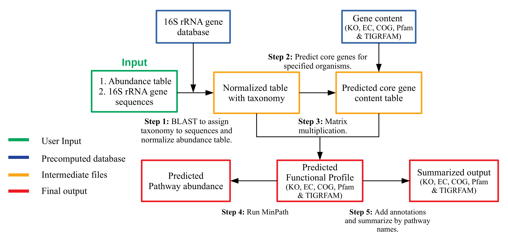
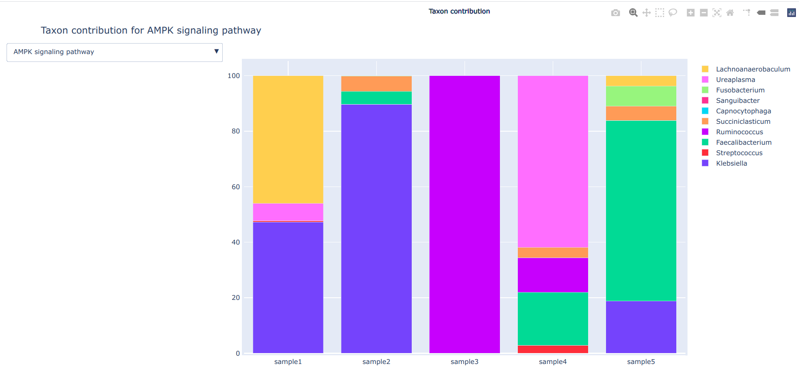

[<p align="center"></p>](http://210.212.161.138/MicFunPred/)

### Webserver: [micfunpred.microdm.net.in](http://micfunpred.microdm.net.in/)

### Reference paper: 
[MicFunPred: A conserved approach to predict functional profiles from 16S rRNA gene sequence data](https://www.sciencedirect.com/science/article/pii/S0888754321003293)

### Motivation: 
There are multiple tools available for the prediction of functional profiles like PICRUSt, Piphillin, Tax4Fun and others. These tools predicts the gene contents of organism without sequenced genomes (at strain level) by using phylogenetic or non-phylogenetic approaches. But, taxonomic identification using one or multiple variable regions of 16S rRNA gene beyond genus level may not be reliable. Secondly, due to database dependency and ever growing reference database size, regular updates are required by these tools. Hence, we proposed a conserved approach to predict gene contents of each genera by considering core genes.

### MicFunPred workflow
MicFunPred relies on ~32,000 genome sequences downloaded from Integrated Microbial Genome database (IMG) representing human, plants, mammals, aquatic and terrestrial ecosystem. 16S rRNA database was constructed using sequences from these genomes and available databases oclustered at 97% identity. MicFunPred is able to predict functional profiles in terms of KEGG Orthology (KO), Enzyme Commission (EC), PFam, TIGRFAM and Cluster of Genes (COG).


MicFunPred is database/approach independent hence, 16S sequence data processed using QIIME1/2 or DADA2 with any database can be used. MicFunPred follows multiple steps to predict functional profiles:

Input files:

1. Abundance/BIOM table (tab separated)
2. OTUs/ASVs sequences (FASTA format)

## Workflow:

#### 1. OTUs/ASVs Sequence mapping
MicFunPred starts by aligning OTUs/ASVs sequences on custom 16S rRNA database using BLAST and assigns genus level taxonomy to each sequence based on user defined percent identity cut-off (-p).

#### 2. Preparation of taxonomy table
The OTU/ASV ids from abundance table are replace by assigned genus and the table is then consolidated and normalized using mean 16S rRNA gene copy numbers of respective genera.

#### 3. Prediction of core genes (Core gene content table)
The core genes for each genera present in abundance table generated above are predicted as per user defined gene coverage cut-off (-c). The core gene is defined as the gene present in x% of the genomes of respective genera. Here, x is gene coverage cut-off and can be adjusted by user (0-1). The value of '0' disables the prediction of core genes.

#### 4. Prediction of metagenomic profiles
The multiplication of abundance table and core gene content table is generated as metagenomic profiles in terms of gene families as stated above.

#### 5. Prediction of pathways
MinPath is used to predict KEGG and MetaCyc pathways with more stringency.

## Installation:

#### Install from source

```
git clone git@github.com:microDM/MicFunPred.git

cd MicFunPred

sudo python setup.py install
```

OR

```
git clone git@github.com:microDM/MicFunPred.git

cd MicFunPred

sudo python -m pip install .
```

#### Dependencies:

#### 1. NCBI-BLAST
```
sudo apt-get install ncbi-blast+
```

For windows download from [NCBI website](https://ftp.ncbi.nlm.nih.gov/blast/executables/blast+/LATEST/) and add blastn.exe to system environment variable.

#### 2. GLPK-utils
```
sudo apt-get install glpk-utils
```

For windows download from [Sourceforge](https://sourceforge.net/projects/winglpk/) and add glpsol.exe to system environment variable.

#### Running MicFunPred:

```
usage: MicFunPred_run_pipeline.py [-h] [-i PATH] [-r PATH] [-p PERC_IDENT] [-b PATH] [-c GENECOV] [-o PATH] [-t INT] [-v] [--contrib]
                                  [--plot]

optional arguments:
  -h, --help            show this help message and exit

Required:
  -i PATH, --otu_table PATH
                        Tab delimited OTU table
  -r PATH, --repset_seq PATH
                        Multi-fasta file of OTU/ASV sequences

Optional:
  -p PERC_IDENT, --perc_ident PERC_IDENT
                        [Optional] Percent identity cut-off to assign genus. (default: 97)
  -b PATH, --blastout PATH
                        Blast output of ASV/OTU sequences with any database in output format 6
  -c GENECOV, --genecov GENECOV
                        [Optional] Percentage of organism in a genus which should have gene to define it as core. Value ranges from 0 to 1
                        (default: 0.5)
  -o PATH, --output PATH
                        [Optional] Output directory (default: MicFunPred_out)
  -t INT, --threads INT
                        (Optional) number of threads to be used. (default: 1)
  -v, --verbose         Print message of each step to stdout.
  --contrib             Calculate taxon contribution of functions
  --plot                Plot contribution for KEGG pathways
```
### Example:

```
MicFunPred_run_pipeline.py -i test_data/test_counts.tsv -r test_data/test.fasta -o test_data/micfunpred_out --verbose
```

The output directory will have following files:
```
├── COG_metagenome
│   ├── COG_metagenome.tsv.gz
│   ├── COG_metagenome_with_description.tsv.gz
│   └── COG_taxon_contrib.tsv.gz
├── KO_metagenome
│   ├── KO_level_taxon_contrib.html
│   ├── KO_level_taxon_contrib.tsv.gz
│   ├── KO_metagenome.tsv.gz
│   ├── KO_metagenome_minPath_pruned.txt
│   ├── KO_metagenome_with_description.tsv.gz
│   ├── KO_taxon_contrib.tsv.gz
│   ├── minpath.out
│   ├── minpath_in.ko
│   ├── summarized_by_A.tsv.gz
│   ├── summarized_by_B.tsv.gz
│   ├── summarized_by_C.tsv.gz
│   └── summarized_by_Pathway_Module.tsv.gz
├── MetaCyc_metagenome
│   ├── EC_metagenome.tsv.gz
│   ├── EC_taxon_contrib.tsv.gz
│   ├── PathwayAbundance.tsv.gz
│   ├── PathwayAbundance_with_names.tsv.gz
│   ├── Pathway_summarize_by_Types.tsv.gz
│   ├── RXN_metagenome.tsv.gz
│   └── minPath_files
│       ├── sample1_minpath.out
│       ├── sample1_minpath.out.details
│       ├── sample1_minpath_in.txt
│       ├── sample2_minpath.out
│       ├── sample2_minpath.out.details
│       ├── sample2_minpath_in.txt
│       ├── sample3_minpath.out
│       ├── sample3_minpath.out.details
│       ├── sample3_minpath_in.txt
│       ├── sample4_minpath.out
│       ├── sample4_minpath.out.details
│       ├── sample4_minpath_in.txt
│       ├── sample5_minpath.out
│       ├── sample5_minpath.out.details
│       └── sample5_minpath_in.txt
├── Pfam_metagenome
│   ├── Pfam_metagenome.tsv.gz
│   ├── Pfam_metagenome_with_description.tsv.gz
│   └── Pfam_taxon_contrib.tsv.gz
├── TIGRFAM_metagenome
│   ├── TIGRFAM_metagenome.tsv.gz
│   ├── TIGRFAM_metagenome_with_description.tsv.gz
│   └── TIGRFAM_taxon_contrib.tsv.gz
├── out.blast
├── predicted_16S_copy_numbers.txt
├── predicted_COG.tsv.gz
├── predicted_EC.tsv.gz
├── predicted_KO.tsv.gz
├── predicted_Pfam.tsv.gz
├── predicted_TIGRFAM.tsv.gz
├── tax_abund.table
└── tax_abund_normalized.table

6 directories, 51 files

```

### Percent contribution of each taxon in KEGG pathways



This plot is generated using [Python plotly==4.9.0](https://plotly.com/python/). Different pathways can be browse using dropdown button and plots can be saved in '.png' format.

### Acknowlegments
We would like to thanks Department of Biotechnology, Government of India and National Centre for Cell Science, Pune for funding and support. We also like to thanks contributors [Nikeeta Chavan](https://github.com/nikeetaC), [Nitin Narwade](https://github.com/nitinnarwade) and [Dhiraj Dhotre](https://www.linkedin.com/in/dhiraj-dhotre-36ab7a75/) 
